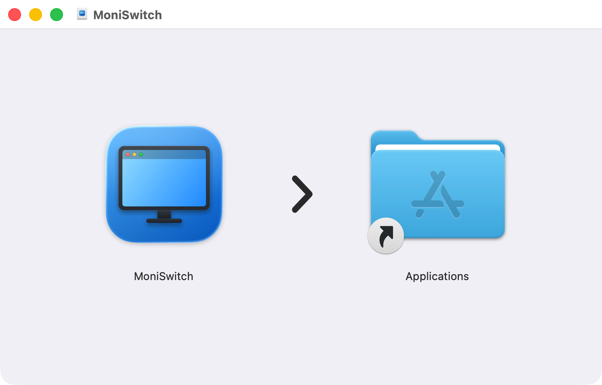

<h1 align="center">
   MoniSwitch
</h1>

<p align="center">
  A macOS menu-bar utility: switch the main display, move external screens left or right, and toggle extend/mirror without a trip to System Settings → Displays.
</p>

<p align="center">
  English · <a href="README.zh-CN.md">简体中文</a> · <a href="https://m1688-cpu.github.io/MoniSwitch/">Website</a>
</p>

<p align="center">
  
  
  
  
</p>

## Features

- Lives in the menu bar: click the icon to open a bubble-card panel with a native popover look (arrow pointing at the icon, centered above it, expand animation); clicking anywhere outside dismisses it
- Click any display in the panel to make it the main display (the one with the menu bar)
- Unfold a screen's parameter group to place an external screen to the left or right of the main display
- Collapsible arrangement card: each screen's position/resolution/refresh-rate rows fold under its name row, collapsed by default with only one expanded at a time; click a block in the layout preview to jump straight to that screen
- The panel resizes with its content instead of scrolling inside; expand/collapse plays a smooth spring animation, and cards lift softly on hover
- Toggle an external screen between "extended desktop" and "mirroring" in one click; the panel labels the mirror target screen
- One-click auto-arrange lays all screens out side by side, removes overlaps, and keeps mirror groups intact
- Layout presets: save a whole display configuration (main + position + mirroring) as a preset and restore it in one click (e.g. "Desk", "Presentation")
- Presets matching the current layout get a "Current" badge automatically; matching compares resolution/refresh rate/position/mirror state, so screen-id drift does not break it
- When persistent ids change after re-plugging a display, presets are remapped automatically by resolution and screen count
- Switch any screen's refresh rate (60Hz ↔ 120Hz) and resolution right in the panel, main display included
- Resolution options are tagged HiDPI / low-resolution; re-picking a resolution no longer loses HiDPI scaling (no more "tiny icons" on 4K screens)
- Bind one global hotkey per preset (Carbon `RegisterEventHotKey`, no permissions needed) and apply a layout with a keystroke
- The layout preview draws displays to scale; click a block to select it and unfold that screen's parameters, and hovering a list row highlights the matching block
- A progress bar covers each switch while it is in flight, with a double-click guard; failed switches raise a system notification
- The panel and settings window track the accent color from System Settings → Appearance and update it live
- The settings window covers bilingual UI, launch at login, auto-refresh (with interval picker), and post-switch notifications
- Switch the UI language in one click; the choice persists across restarts

## Screenshots

> The UI language switches in one click (English / 简体中文); the screenshots below show the English interface.

<table>
  <tr>
    <td align="center">
      
      <br><b>Panel overview</b> · Main display / arrangement / presets / layout preview / toolbar
      <br><sub>Bubble-card panel that follows the system accent color</sub>
    </td>
  </tr>
  <tr>
    <td align="center">
      
      <br><b>Arrangement expanded</b> · Position / resolution / refresh rate + mirror & extend
      <br><sub>Click a display row to unfold its parameter group; the resolution row expands into an option list (HiDPI tagged)</sub>
    </td>
  </tr>
  <tr>
    <td align="center">
      
      <br><b>Settings · General</b> · Language / launch at login / auto-refresh / notifications
      <br><sub>The refresh-interval picker appears once auto-refresh is on</sub>
    </td>
  </tr>
  <tr>
    <td align="center">
      
      <br><b>Settings · Presets</b> · Save / apply / delete + global hotkey binding
      <br><sub>Each preset can record one hotkey (Esc to cancel)</sub>
    </td>
  </tr>
  <tr>
    <td align="center">
      
      <br><b>Settings · About</b> · Icon / description / version
    </td>
  </tr>
</table>

## Install

### Option 1: Download the DMG (recommended)

<p align="center">
  
  <br><sub>Open the DMG and drag MoniSwitch into Applications</sub>
</p>

1. Go to the [Releases page](../../releases) and download the latest `MoniSwitch.dmg`
2. Open it and drag MoniSwitch into the Applications folder
3. On first launch, macOS may say it "can't be opened because it is from an unidentified developer"
   - The app is not Apple-notarized (see [the note below](#about-the-notarization-warning))
   - To proceed: open System Settings → Privacy & Security and click Open Anyway

### Option 2: Build from source (developers)

```bash
# 1. Clone
git clone https://github.com/<your-username>/MoniSwitch.git
cd MoniSwitch

# 2. Place the displayplacer binary (see Resources/README.md)
cp /path/to/displayplacer-apple-v140 ./Resources/displayplacer
chmod +x ./Resources/displayplacer

# 3. One-shot packaging (compile + assemble .app + sign + .dmg)
bash Support/build-app.sh

# 4. Outputs land in Support/
#    - Support/MoniSwitch.app
#    - Support/MoniSwitch.dmg
```

## Usage

1. Launch MoniSwitch; a display icon appears in the menu bar
2. Click the icon to open the panel with all displays and the layout preview
3. Main display card: click any display name to make it the main display
4. Arrange & mirror card: click a display row to unfold its parameter group (position, resolution, refresh rate); switch mirroring/extend for external screens here, or auto-arrange everything
5. Presets card: click a preset to restore a whole layout; the one matching the current layout carries a "Current" badge
6. Click anywhere outside the panel to dismiss it

## About the notarization warning

MoniSwitch is distributed as a direct DMG download rather than through the Mac App Store, so it carries no Apple notarization.
This is common for open-source freeware, and the app itself is safe (the code is fully open for review).
Approve it once via Privacy & Security as described above and you won't be prompted again.

## How it works

MoniSwitch is a GUI on top of [displayplacer](https://github.com/jakehilborn/displayplacer) (MIT License, © Jake Hilborn), which performs the actual display configuration.
The displayplacer binary is bundled with the app and works out of the box.

- Switch main display: moves the target screen's `origin` to `(0,0)` and shifts the others by the same vector to keep left/right relations
- Move left/right: adjusts the external screen's `origin.x`
- Mirror/extend: uses displayplacer's `id:A+B` mirror syntax / restores a side-by-side extended layout

## Tech stack

- Language: Swift 6
- UI: SwiftUI + AppKit (`NSStatusItem` + `NSPopover` menu-bar panel, macOS 13+)
- Build: Swift Package Manager (plain-text `Package.swift`, builds from the command line)
- Type: pure menu-bar app (`LSUIElement = YES`, no Dock icon)
- Distribution: non-sandboxed, local ad-hoc signing, direct DMG download

## Project structure

```
MoniSwitch/
├── Package.swift                  # SPM build manifest
├── Sources/MoniSwitch/
│   ├── MoniSwitchApp.swift        # @main entry (AppDelegate starts the menu-bar icon + ⌘, command)
│   ├── PanelController.swift      # Menu-bar panel controller (NSStatusItem + NSPopover hosting PanelView)
│   ├── AppState.swift             # UI state object (display list + all switching ops + in-flight state)
│   ├── PanelView.swift            # Menu-bar bubble-card panel (main/arrange/presets/interactive layout preview)
│   ├── Components.swift           # Shared visual components (BubbleCard/RowButton/ActivePill etc.)
│   ├── BubbleMetrics.swift        # Corner radii/font/spacing scale + bubble background colors
│   ├── Models.swift               # Display data models
│   ├── ShellRunner.swift          # displayplacer invocation wrapper
│   ├── DisplayManager.swift       # Parsing + switching algorithms (mirror groups/auto-arrange/id-drift remap/stability detection)
│   ├── AppSettings.swift          # User defaults singleton (launch at login/notifications/auto-refresh)
│   ├── PresetManager.swift        # Layout presets (save/apply/delete/hotkey binding)
│   ├── HotkeyManager.swift        # Global hotkeys (Carbon RegisterEventHotKey, zero permissions)
│   ├── DockPolicyManager.swift    # Dock policy + settings window host (NSWindow)
│   ├── SettingsView.swift         # Settings window skeleton (sidebar + floating header + scrolling blur)
│   ├── SettingsTabs.swift         # Settings tabs (General/Presets/About)
│   └── Localization.swift         # Bilingual strings (L10n + TextKey, t() with %d/%@)
├── Resources/
│   ├── displayplacer              # Bundled display-control binary (not committed)
│   ├── AppIcon.icns               # App icon
│   └── AppIcon-source.png         # Icon source (rendered by make-app-icon-design.swift)
├── Support/
│   ├── Info.plist                 # App metadata (LSUIElement etc.)
│   ├── build-app.sh               # One-shot packaging script
│   └── make-app-icon.sh           # Rebuild AppIcon.icns (pure-code render by default)
├── screenshots/                   # README screenshots (en/zh pairs, same filenames)
├── README.md                      # This file (default, English)
├── README.zh-CN.md                # Simplified Chinese README
└── GITHUB_GUIDE.md                # Maintainer's GitHub handbook
```

## Roadmap

- [x] Display list + main-display switching
- [x] Move external screens left/right
- [x] Extend / mirror toggle
- [x] Custom app icon
- [x] Bilingual UI switch
- [x] Settings window (General / Presets / About)
- [x] Launch at login
- [x] Post-switch system notifications
- [x] Auto-refresh the display list
- [x] Refresh rate & HiDPI shown in the menu
- [x] Layout presets (save/restore whole configurations in one click)
- [x] Switch external-screen refresh rate in the menu
- [x] Global hotkeys (one per preset)
- [x] Bubble-card panel UI (replacing the plain text menu)
- [x] In-panel layout preview (displays drawn to scale)
- [x] Follows the system accent color
- [x] Pure-code app icon (Liquid-Glass-style display)
- [x] In-operation feedback (progress bar + double-click guard) and failure notifications
- [x] One-click auto-arrange (side by side, overlap-free, mirror-group aware)
- [x] Preset id-drift auto remap
- [x] HiDPI-safe resolution switching (variant tagging, no accidental low-res mode)
- [x] Collapsible arrangement card (per-display parameter groups, layout-preview click linkage)
- [x] "Current" preset badge
- [x] Panel migrated to NSPopover (arrow/centered/animation/dismiss on outside click)
- [ ] Intel support
- [ ] Multi-display (>2) polish
- [ ] Apple notarization

## License

MIT License. This repository's code © the MoniSwitch author.
The bundled displayplacer © Jake Hilborn, also under the MIT License.

## Acknowledgements

- [displayplacer](https://github.com/jakehilborn/displayplacer), the command-line tool that performs the underlying display control in this project.
