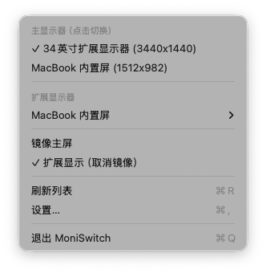
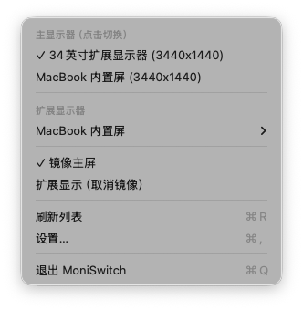
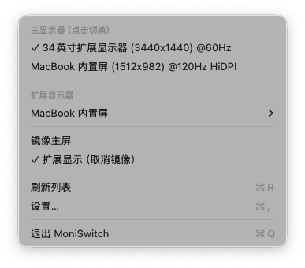
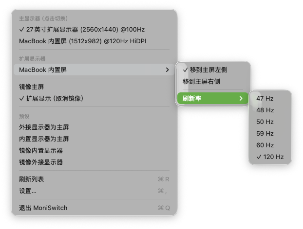
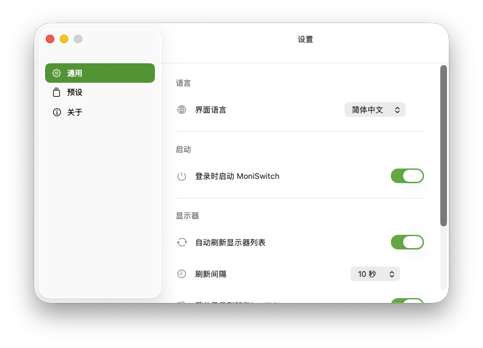
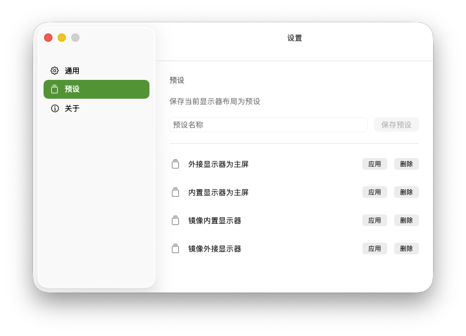
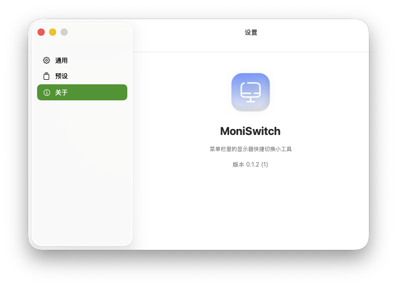

# MoniSwitch

> 一个简洁的 macOS 菜单栏小工具，让你不用进「系统设置 → 显示器」就能快速切换主显示器、调整外接屏的左右位置、以及在外接屏上切换扩展/镜像。


## 功能

- 🖥️ **菜单栏常驻**：点击菜单栏图标即弹出显示器列表
- 🔀 **一键切主屏**：在列表里点任意显示器，立即把它设为主显示器（白条所在屏）
- ↔️ **左右移动外接屏**：把外接屏放到主屏的左边或右边
- 🪞 **扩展 / 镜像切换**：把外接屏在「扩展显示」和「镜像主屏」之间切换
- 📦 **布局预设**：把整套显示器配置（主屏+位置+镜像）保存为预设，一键切换（如「办公」「演示」）
- 🔄 **菜单切换刷新率**：直接在菜单里切换外接屏刷新率（如 60Hz ↔ 120Hz）
- ⚙️ **设置窗口**：中英双语、开机自启动、切换后通知、自动刷新列表
- 🌐 **中英双语**：界面语言一键切换，重启后保持

## 截图

### 菜单栏菜单

点击菜单栏图标即弹出显示器列表，当前主屏前显示 ✓。



### 镜像 / 扩展切换

镜像态下「镜像主屏」前显示 ✓，一键切换扩展 / 镜像。



### 菜单显示刷新率与 HiDPI

开启设置后，菜单项追加 `@Hz` 与 `HiDPI` 信息。



### 菜单内切换刷新率

展开外接屏菜单，直接切换该屏支持的刷新率，当前生效项打勾。



### 设置窗口 — 通用

语言、启动、显示器、通知四组偏好。



### 设置窗口 — 预设

保存当前显示器布局为命名预设，一键应用或删除。



### 设置窗口 — 关于

应用图标与版本号。



## 安装

### 方式一：下载 DMG（普通用户推荐）

1. 前往 [Releases 页面](../../releases)，下载最新的 `MoniSwitch.dmg`
2. 双击打开，把 **MoniSwitch** 拖入 **Applications** 文件夹
3. 首次打开时，macOS 可能提示「无法打开，因为来自身份不明的开发者」
   - 这是因为本 App 未做 Apple 公证（见下方[说明](#关于未公证提示)）
   - 解决：打开「系统设置 → 隐私与安全性」，点击「仍要打开」即可

### 方式二：自行编译（开发者）

```bash
# 1. 克隆仓库
git clone https://github.com/<你的用户名>/MoniSwitch.git
cd MoniSwitch

# 2. 放置 displayplacer 二进制（见 Resources/README.md）
cp /path/to/displayplacer-apple-v140 ./Resources/displayplacer
chmod +x ./Resources/displayplacer

# 3. 一键打包（编译 + 组装 .app + 签名 + 生成 .dmg）
bash Support/build-app.sh

# 4. 产物在 Support/ 目录下
#    - Support/MoniSwitch.app
#    - Support/MoniSwitch.dmg
```

## 使用

1. 打开 MoniSwitch 后，菜单栏会出现一个显示器图标
2. 点击图标，看到当前所有显示器列表
3. **点击任意显示器名称** → 立即设为主屏
4. 展开「外接显示器」子菜单 → 左/右移动、镜像、扩展

## 关于未公证提示

MoniSwitch 采用「DMG 直链分发」而非 Mac App Store，因此没有 Apple 公证。
这是开源/免费小工具的常见做法，App 本身安全（代码完全开源可审查）。
首次打开按上述步骤在「隐私与安全性」放行即可，之后不会再提示。

## 工作原理

MoniSwitch 是一个友好的图形界面，底层调用 [displayplacer](https://github.com/jakehilborn/displayplacer)（MIT License，© Jake Hilborn）完成实际的显示器配置。
displayplacer 二进制随 App 一起打包，**开箱即用，无需额外安装**。

- 切换主屏：把目标屏的 `origin` 平移到 `(0,0)`，其余屏按相同向量平移以保持左右关系
- 左/右移动：调整外接屏的 `origin.x`
- 镜像/扩展：使用 displayplacer 的 `id:A+B` 镜像语法 / 还原为并排扩展布局

## 技术栈

- **语言**：Swift 6
- **UI**：SwiftUI `MenuBarExtra`（macOS 13+ 原生菜单栏 API）
- **构建**：Swift Package Manager（纯文本 `Package.swift`，命令行即可编译）
- **类型**：纯菜单栏 App（`LSUIElement = YES`，无 Dock 图标）
- **分发**：非沙盒，本地 ad-hoc 签名，DMG 直链

## 项目结构

```
MoniSwitch/
├── Package.swift                  # SPM 构建配置
├── Sources/MoniSwitch/
│   ├── MoniSwitchApp.swift        # 菜单栏 UI 入口
│   ├── Models.swift               # 显示器数据模型
│   ├── ShellRunner.swift          # displayplacer 调用封装
│   ├── DisplayManager.swift       # 解析 + 切换算法（含镜像组检测）
│   ├── AppSettings.swift          # 用户偏好单例（自启动/通知/自动刷新）
│   ├── PresetManager.swift        # 显示器布局预设管理（保存/应用/删除）
│   ├── DockPolicyManager.swift    # Dock 策略 + 设置窗口（NSWindow + NSToolbar）
│   ├── SettingsView.swift         # 设置窗口 SwiftUI 视图
│   └── Localization.swift         # 中英双语（L10n 类 + TextKey 枚举）
├── Resources/
│   ├── displayplacer              # 打包的显示控制二进制（不入库）
│   ├── AppIcon.icns               # 应用图标
│   └── AppIcon-source.png         # 图标源图
├── Support/
│   ├── Info.plist                 # App 元信息（LSUIElement 等）
│   └── build-app.sh               # 一键打包脚本
├── screenshots/                   # README 截图（待补充）
├── README.md                      # 本文件
└── GITHUB_GUIDE.md                # 维护者的 GitHub 操作手册
```

## 路线图

- [x] 显示器列表 + 切换主屏
- [x] 外接屏左/右移动
- [x] 扩展 / 镜像切换
- [x] 自定义 App 图标
- [x] 中英双语界面切换
- [x] 设置窗口（通用 / 预设 / 关于）
- [x] 开机自启动选项
- [x] 切换后系统通知
- [x] 自动刷新显示器列表
- [x] 菜单显示刷新率与 HiDPI
- [x] 显示器布局预设（一键保存/切换整套配置）
- [x] 菜单内切换外接屏刷新率
- [ ] 适配 Intel 芯片
- [ ] 多屏（>2）场景优化
- [ ] 全局快捷键（开发中，下个版本）
- [ ] Apple 公证

## License

MIT License。本仓库代码 © MoniSwitch 作者。
随包分发的 displayplacer © Jake Hilborn，同样为 MIT License。

## 致谢

- [displayplacer](https://github.com/jakehilborn/displayplacer) — 没有这个优秀的命令行工具，本项目就无法实现底层显示器控制。
